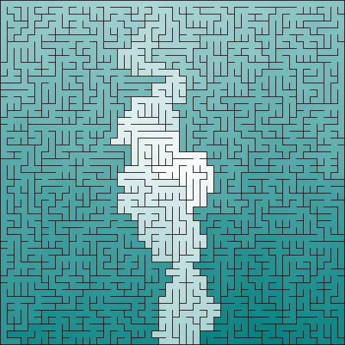

# Mazes for programmers - the python version

Code I wrote while going through the book
[Mazes for Programmers: Code Your Own Twisty Little Passages](https://www.amazon.com/Mazes-Programmers-Twisty-Little-Passages/dp/1680500554).
The algorithms and datastructures in the book are written in ruby. I chose to do the exercises in python.

## Set up

Was developed using python 3.8, should work starting at 3.6 (I use `f-strings`), but was not tested.
You should not need anything besides `pip install -r requirements.txt`.

## Run

There are various demo scripts in the root folder that can be run. These will generate a png file with the generated maze in the results folder.

For example, running `python sidewinder_demo.py` will generate a maze that looks like:

Another example is `python coloring_demo.py` resulting in:
